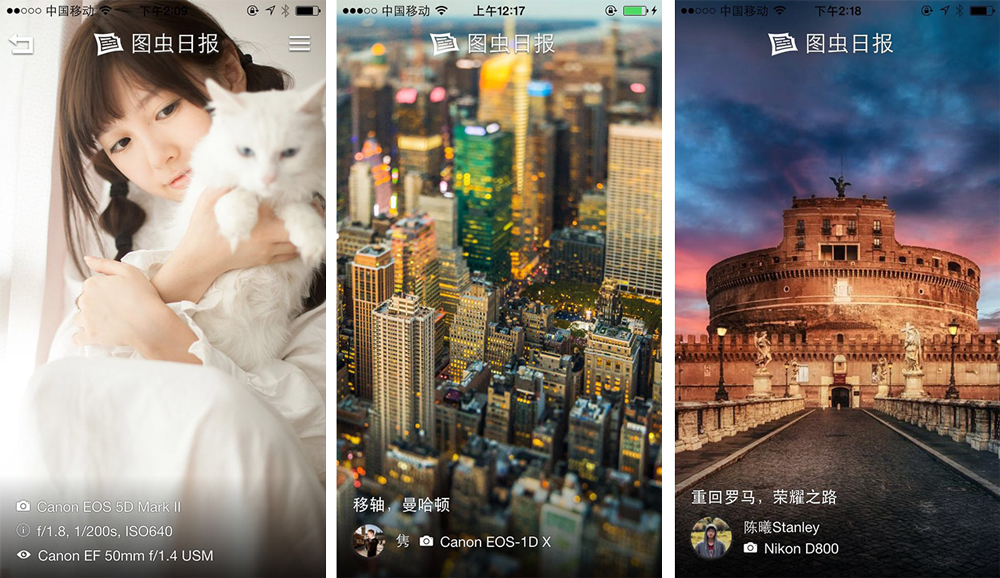

## 图虫日报



### 本地开发

安装开发依赖：

```bash
$ npm install
$ bower install
```

启用本地工作流，开始调试：

```bash
$ npm run dev
```

### 应用调试

#### 安装插件

图虫日报依赖以下插件:

```bash
$ cordova plugin add org.apache.cordova.device
$ cordova plugin add org.apache.cordova.dialogs
$ cordova plugin add org.apache.cordova.statusbar
$ cordova plugin add https://github.com/phonegap-build/PushPlugin.git
$ cordova plugin add https://github.com/xu-li/cordova-plugin-wechat
```

添加发布平台

```bash
$ cordova platform add ios
```

#### 真机调试

```bash
$ ionic build ios
$ ionic run ios
```

### MIT license
Copyright (c) 2014 turing &lt;o.u.turing@gmail.com&gt;

Permission is hereby granted, free of charge, to any person obtaining a copy
of this software and associated documentation files (the &quot;Software&quot;), to deal
in the Software without restriction, including without limitation the rights
to use, copy, modify, merge, publish, distribute, sublicense, and/or sell
copies of the Software, and to permit persons to whom the Software is
furnished to do so, subject to the following conditions:

The above copyright notice and this permission notice shall be included in
all copies or substantial portions of the Software.

THE SOFTWARE IS PROVIDED &quot;AS IS&quot;, WITHOUT WARRANTY OF ANY KIND, EXPRESS OR
IMPLIED, INCLUDING BUT NOT LIMITED TO THE WARRANTIES OF MERCHANTABILITY,
FITNESS FOR A PARTICULAR PURPOSE AND NONINFRINGEMENT. IN NO EVENT SHALL THE
AUTHORS OR COPYRIGHT HOLDERS BE LIABLE FOR ANY CLAIM, DAMAGES OR OTHER
LIABILITY, WHETHER IN AN ACTION OF CONTRACT, TORT OR OTHERWISE, ARISING FROM,
OUT OF OR IN CONNECTION WITH THE SOFTWARE OR THE USE OR OTHER DEALINGS IN
THE SOFTWARE.

---

built upon love by [docor](https://github.com/turingou/docor.git) v0.2.0